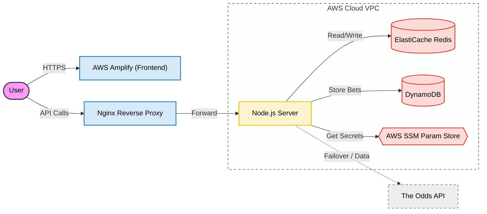

# Stakt - Sports Arbitrage Finder

A production-ready sports arbitrage hunting platform that scans bookmakers for guaranteed profit opportunities ("arbs"). Built with a focus on cloud-native architecture, security, and high performance.


## 🚀 Features

### Core Arbitrage Engine
*   **Real-time Odds**: Integrates with [The Odds API](https://the-odds-api.com/).
*   **Guaranteed Profit**: Automatically calculates edge percent, stake splits, and rounding logic.
*   **Fail-Open Caching**: Multi-layer Redis strategy ensures odds are served instantly even if the API is slow.

### Modern Frontend (React + Amplify)
*   **Interactive PnL Portfolio**: Track your comprehensive betting history with a `recharts` performance graph derived from actual bet data.
*   **Smart Grouping**: Bets are automatically grouped by Event.
*   **Auto-Sync**: Marking one outcome as "Win" automatically resolves sibling bets as "Lose".
*   **Premium UX**: Dark "Navy" theme, glassmorphism elements, and a subtle **animated nebula background**.
*   **Authentication**: Secure signup/login via AWS Cognito (Google Social Auth enabled).

### Enterprise Backend (Node.js)
*   **VPC Architecture**: Deployed on AWS EC2, protected by Security Groups.
*   **Redis Cluster**: Connected to **AWS ElastiCache** (Cluster Mode + TLS) for globally distributed caching.
*   **Secret Management**: Zero code secrets. API keys are fetched at runtime from **AWS Systems Manager Parameter Store**.
*   **Rate Limiting**: Protected by `express-rate-limit` (100 req/15min).
*   **Persistence**: AWS DynamoDB for immutable bet history storage.

## 🏗️ Architecture



## 🛠️ Tech Stack

*   **Frontend**: React, Vite, AWS Amplify UI, Recharts.
*   **Backend**: Node.js, Express, AWS SDK v3.
*   **Database**: AWS DynamoDB (Serverless).
*   **Caching**: Redis (Cluster Mode).
*   **Infrastructure**: AWS EC2, Amplify Hosting, Route53, Systems Manager.

## 📦 Setup & Installation

### 1. Prerequisites
*   Node.js v18+
*   AWS Account (DynamoDB, SSM, Cognito)
*   Redis (Local Docker or ElastiCache)

### 2. Environment Variables

**Backend (`server/.env`):**
```env
PORT=4000
REDIS_HOST=localhost (or clustercfg.xxx.cache.amazonaws.com)
REDIS_PORT=6379
DDB_TABLE=ArbBets
COGNITO_REGION=us-east-1
COGNITO_USER_POOL_ID=us-east-1_xxxx
COGNITO_APP_CLIENT_ID=xxxx
```

**Frontend (`client/.env`):**
```env
VITE_API_URL=https://api.stakt.live (or http://localhost:4000)
```

### 3. Running Locally
```bash
# 1. Start Redis
docker run -p 6379:6379 -d redis

# 2. Start Backend
cd server
npm install
npm run dev

# 3. Start Frontend
cd client
npm install
npm run dev
```

## 🔒 Security Best Practices
1.  **Secret Rotation**: Use AWS SSM to rotate the `ODDS_API_KEY` without redeploying code.
2.  **Least Privilege**: The EC2 instance role only has permission to `PutItem` on the specific DDB table and `GetParameter` for the specific SSM path.
3.  **TLS Encryption**: All Redis connections (if ElastiCache) are encrypted in transit.

## 🧪 Testing & CI/CD
This project uses **Jest** for backend unit testing and **GitHub Actions** for automated validation.

### Running Tests Locally
```bash
cd server
npm test
```
This executes the test suite in `server/tests/`, verifying:
*   Arbitrage Math Logic (Positive/Negative cases)
*   Data parsing resilience

### Automated Pipeline
On every `git push` to `main`, GitHub Actions:
1.  Installs dependencies (Client & Server).
2.  Builds the React Frontend.
3.  Runs the Backend Unit Tests.
4.  (Optional) Deploys to AWS if all checks pass.

## 📈 Performance
*   **Cache Hit**: < 3ms response time.
*   **Cache Miss**: ~400ms (API fetch) -> Auto-caches for 15 minutes.
